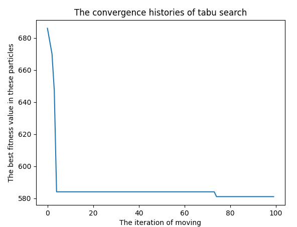

This repository document some meta-heuristic assignments when I am studying my graduate degree.
---
ABC.py : Use **ABC(Artificial Bee Colony)** to resolve Rastrigin and STYBLINSKI-TANG function.  
FA.py : Use **FA(Firefly algorithm)** to resolve Rastrigin and STYBLINSKI-TANG function.  
GA.py : Use **GA(Genetic algorithm)** to resolve Polynomial.  
nomad_algorithm.py : The algorithm developed by myself, details can be found in nomad_algorithm.docx and nomad_algorithm.pptx.  
PSO.py : Use **PSO(Particle Swarm Optimization)** to resolve Rastrigin and STYBLINSKI-TANG function.  
TSP.py : Use **TS(Tabu Search)** to resolve the TSP(Travelling salesman problem, TSP).  
TSP_exhaustive_enumeration.py : Exhaustive enumeration all possible results to compared with TS method in TSP.py.  

Following is the result of TSP.py, which shows a decrease in the total distance required to travel through all the cities from 682 to 575.
